# Tutoriel HTML/CSS destiné aux élèves de l'EFAP 1A 2018-2019

## Avant-propos
L'objectif de cette introduction au HTML/CSS est de :
  - Comprendre le HTML & CSS en mettant les mains dans le cambouis : vous allez coder un site Web composé de deux pages Web statiques (en faisant des copier-coller principalement #tranquillou 😎😎!)
  - Savoir ce qui se passe derrière un CMS (Wordpress, Joomla, etc) et éventuellement pouvoir personnaliser certains éléments HTML/CSS si c'est possible sur le CMS utilisé

Pour atteindre cet objectif, grâce aux quelques notions vues en classe (prérequis indispensables : balises/attributs HTML et exemples, squelette HTML, selecteurs/propriétés CSS et exemples), nous allons coder un site Web statique. Ce site sera un CV, composé de deux pages Web statiques et sera codé et visualisé en "local" sur votre ordinateur : nous ne nous intéresserons pas à le mettre en ligne sur le Web. (c'est-à-dire à réaliser l'hébergement du site Web sur un serveur Web d'Internet).

## Consignes à respecter
- Réalisez le tutoriel et faites le maximum de choses possibles (vous pouvez tout reussir très facilement jusqu'au 3.5 😉)
- Renommez le dossier "cv" en "cv_EFAP_101_DUPONT_Martin"
- Compressez le dossier entier en zip (clic droit sur le dossier > Compresser).

- Envoyez-moi par mail le dossier compressé avec l'objet "CV EFAP 1ARD DUPONT Martin"

Bon courage !


# 1. Organisons notre plan de travail !
Nous allons nous assurer d'avoir le parfait environnement de travail pour coder proprement notre page Web.
### Outil nº1 : Editeur de Texte
1. Installez l'éditeur de texte : [Sublime Text](https://www.sublimetext.com) (éditeur de texte pour développeurs).

2. Ouvrez l'éditeur et allez personnaliser paramètre de l'application dans "View" > "Side Bar" > "Show Side Bar"
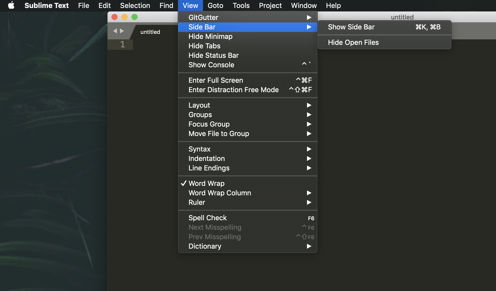

3. Récupérez le dossier ["cv"](https://github.com/Blaked84/efap-work/blob/master/1-CV/cv.zip) avec les images (téléchargez-le en cliquant sur le bouton `Download`). Glissez/déposez le dossier dans l'éditeur de texte. (#DragAndDrop)
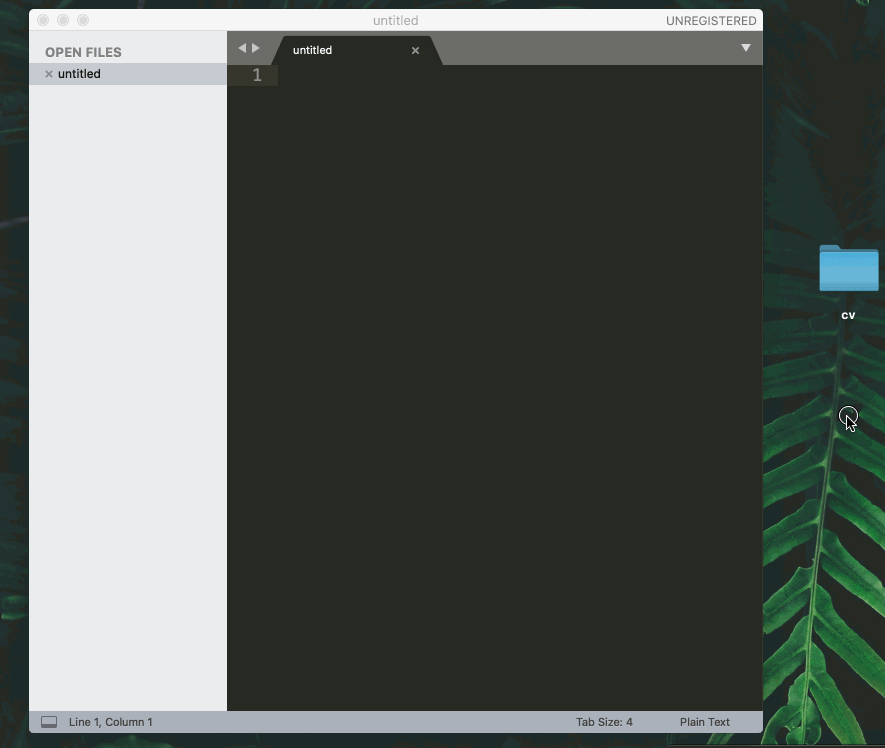
4. Sur l'arbre de navigation de gauche, dans le dossier "cv" vous avez les 2 fichiers sur lesquels nous allons travailler :
  - `index.html`.
  - `style.css`.

### Outil nº2 : Navigateur Web
5. Dans votre explorateur de fichier ("Finder" sur Mac ou "Explorateur de fichers"sur windows), double cliquez sur le fichier `index.html` : le fichier s'ouvre automatiquement avec votre navigateur Web par défaut. Vous devriez visualiser une page blanche, ce qui est rassurant car le fichier `index.html` est vide !
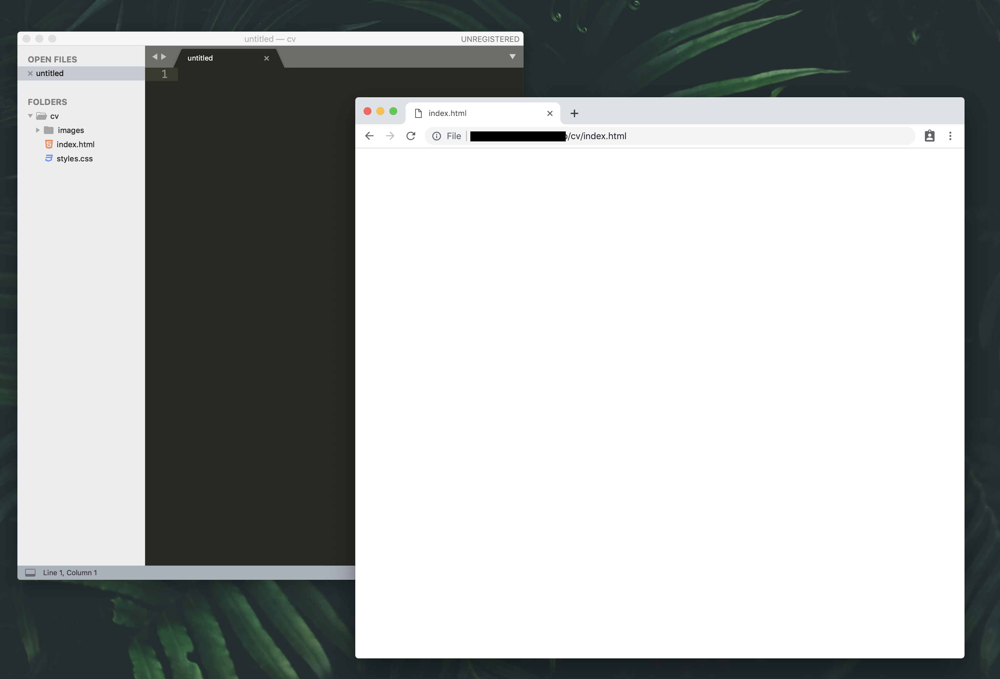
NB : Vous pouvez vous amuser à utiliser l'inspecteur navigateur (clic droit--> Inspecter) pour accéder au code HTML/CSS de la page consultée et faire quelques changements insolites en local ! (puisque vous travaillez en local et pas sur le serveur hébergeant le site, il n'y a que vous, en tant que client, qui pourrez visualiser vos changements : sinon tout le monde pourrez modifier le site de Facebook ! )
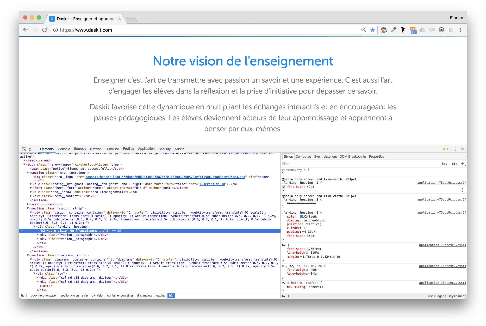

6. Pour faciliter les choses pour la suite : partagez votre plan de travail en deux : éditeur de texte à gauche et navigateur Web à droite. Cf :
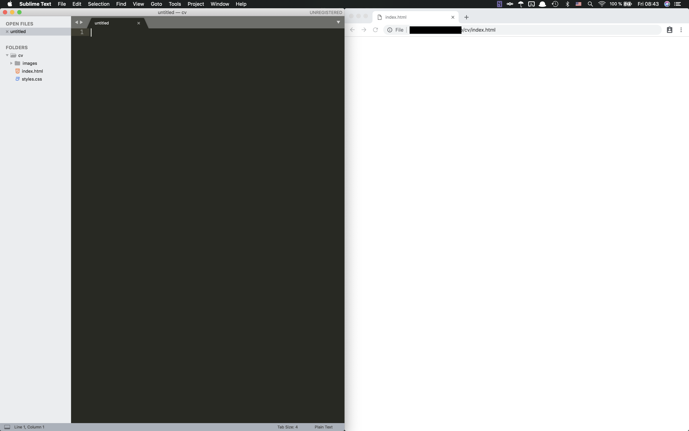
7. Votre plan de travail de parfait développeur est là : vous êtes prêts pour la suite !


# 2. Construisons et structurons notre page HTML !

## 2.1. Insérons le squelette standard d'une page `.html`
* Dans votre document `"index.html"`, tapez `<html` et taper sur la touche `Tab` de votre clavier (Raccourci clavier suite à la suggestion de Sublime Text)

* Que de temps gagné ! Comme par miracle, tout le squelette standard d'une page HTML apparaît :
    - la doctype de votre document : `<!DOCTYPE html>`
    - les balises `<html>`, `<head>` et `<body>`
* Enfin presque, il faudra que vous ajoutiez la balise `<meta charset="UTF-8">` (pour les caractères spéciaux) entre les balises `<head>` et `</head>`


* Les balises d'une page HTML peuvent être pensées comme des **poupées russes** : ```<title>``` est dans le ```<head>``` qui est lui-même dans le ```<html>```. Pour bien visualiser cette image de poupées russes, on fera attention à indenter proprement le code afin d'avoir un code lisible rapidement. Une indentation se fait avec la touche `Tab` (ce qui correspond à deux espaces)

```html
<!DOCTYPE html>
<html>
  <head>
    <meta charset="utf-8">
    <title></title>
  </head>
  <body>
    <h1> </h1>
    <p> </p>
  </body>
</html>
```
au lieu de
```html
<!DOCTYPE html>
<html>
<head>
<meta charset="utf-8">
<title></title>
</head>
<body>
<h1> </h1>
<p> </p>
</body>
</html>
```

* ❗️Attention❗️: une balise qui est ouverte à l'intérieur d'une autre balise doit être fermée à l'intérieur. Il faut faire attention à ce que les balises ne s'entremêlent pas !

## 2.2. Ajoutons notre contenu et balisons le !
* Copiez collez le contenu ci-dessous dans le `<body>` et assurez vous de bien aligner le texte (selectionnez le texte à indenter et appuyez sur la touche `Tab`)
```HTML
	<h1>John Doe</h1>
	Expériences
	2018
	<h3>Président de la république</h3>
	Trop bien ce job, j'ai fait des réformes et personne n'a fait grève.

	Etudes
	2018 
	<h3>EFAP</h3>
```

En sauvegardant le fichier HTML (File > Save) et en rechargeant la page de votre navigateur, vous devriez avoir :
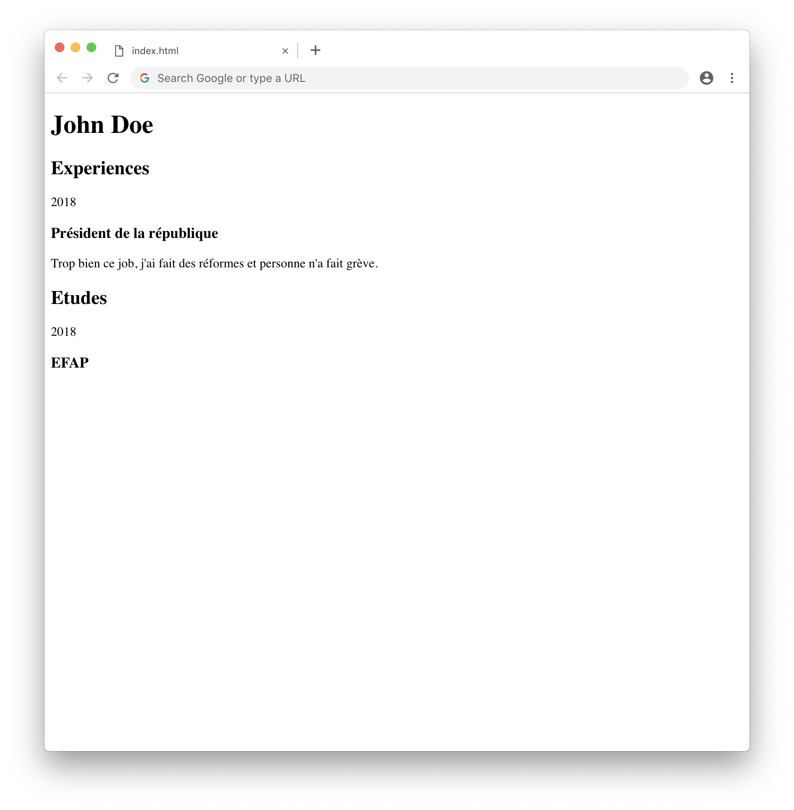

Astuce : le point dans l'onglet index.html indique que le fichier n'est pas enregistré. Si il est enregistré, il devient une croix.
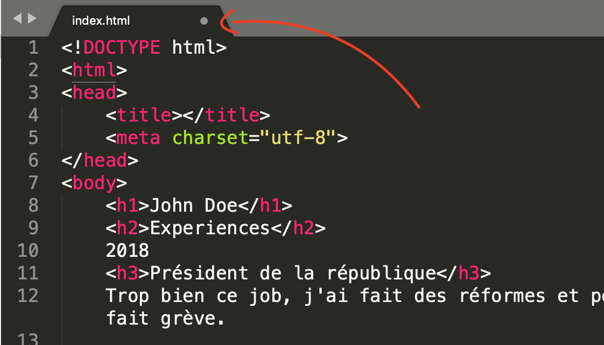

Le résultat est décevant, n'est-ce pas ? Pas de panique ! C'est normal car nous n'avons pas encore touché au CSS et à peine au HTML !

* Replacez bien le titre de la page entre les balises `<title>` pour avoir :

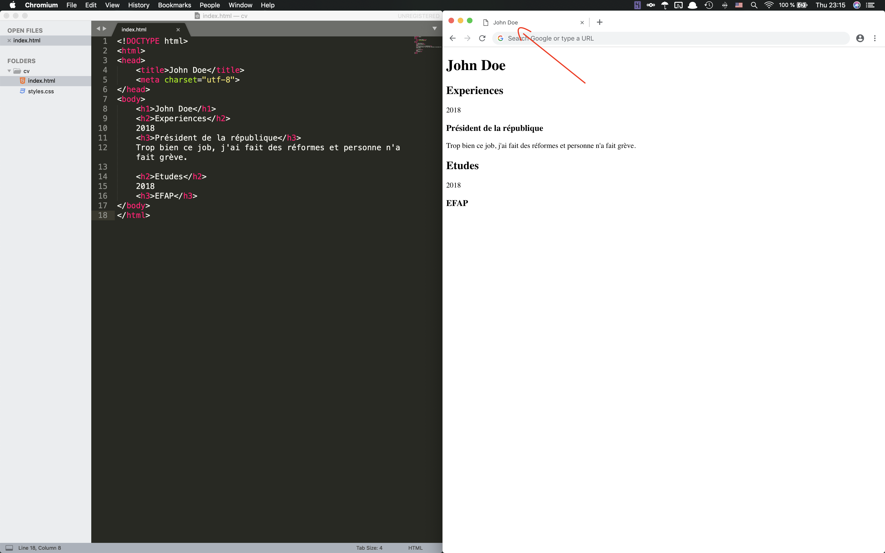

## 2.3. Ajoutons des liens !
Ajoutez-y les liens HTML ci-dessous au bon endroit pour avoir le résultat suivant:

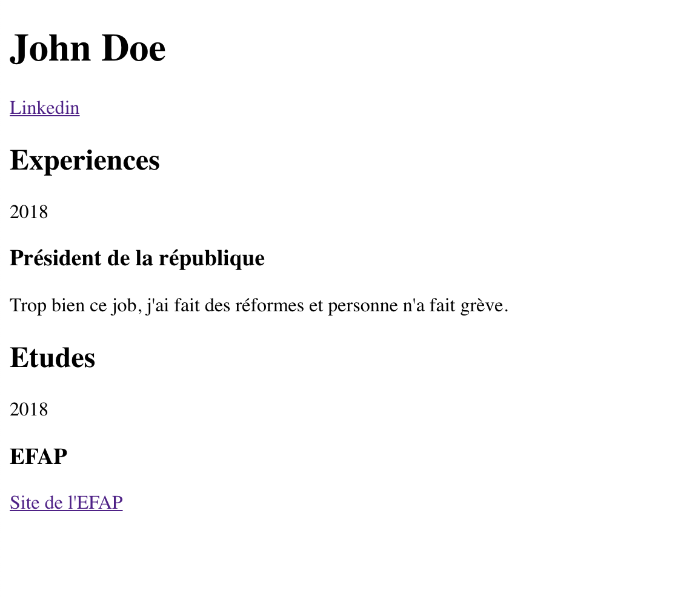

 Balise `<a>` avec l'attribut `href` pour spécifier l'URL du lien. A noter, si vous pouvez rajouter l'attribut facultatif `target="_blank"` pour que la page s'ouvre dans un nouvel onglet : meilleure UX !
 Et bien sur vous pouvez mettre l'URL de votre profile linkedin si vous le voulez (et si vous en avez un).

```html
<!-- Code à copier-coller intelligemment AU BON ENDROIT dans le fichier index.html-->
	<a href="https://www.efap.com/">Site de l'EFAP</a>
	<a href="https://www.linkedin.com/">Linkedin</a>

```

## 2.4. Ajoutons des images !
Ajoutez-y les images/icônes au dessus de chaque caractéristique. Pour cela, vous allez utiliser la balise `` (/!\ la balise `` est une exception car il s'agit d'une balise _orpheline_ et sans balise fermante `</img>`!!) avec l'attribut `src` pour signifier la source et indiquer où se trouve l'image que l'on veut insérer et `alt` pour spécifier le texte alternatif affiché si mauvais téléchargement de l'image et qui est important pour le référencement.

```html
<!-- Code à copier-coller intelligemment AU BON ENDROIT dans le fichier index.html-->

```

A ce stade, on est parvenu à une page Web structurée et lisible bien qu'un peu archaïque. En fait, les premières pages Web ressemblaient à ça et en particulier celles du [premier site Web historique](http://info.cern.ch/hypertext/WWW/TheProject.html) . Vous êtes donc au niveau de la crème de la crème des chercheurs scientifiques du monde ... mais des années 90 ! 😜


# 3. Stylisons notre page avec le CSS !

Evidemment les pages Web d'aujourd'hui ne ressemblent pas à ça grâce au CSS qui permet de _styliser_ les différents élements de la page HTML et d'avoir des pages beaucoup plus agréables à consulter ! L'objectif final étant :


## 3.1. Importons notre feuille de style CSS dans notre feuille HTML

Relions le fichier CSS (`styles.css` créé au début) à la page HTML (`index.html`) dans le `<head>` grâce a la balise `<link>`.
```html
<!-- Code à copier-coller et à adapter intelligemment AU BON ENDROIT dans le fichier index.html-->

<head>
  [...]
  <link href='styles.css' rel='stylesheet'>
</head>
```

## 3.2. Ajoutons des couleurs et des jolies polices
Complétons notre feuille de style CSS maintenant qu'elle est reliée au fichier HTML.

Pour rappel, voici le formalisme : un sélecteur et ses règles de style (une règle de style c'est une proprieté associée à sa valeur)
```css
/* A NE PAS COPIER COLLER !!! */
/* Ceci est un simple rappel du formalisme CSS :*/
selector {
  property1: value1;
  property2: value2;
}
```

```css
/*Code à copier-coller AU BON ENDROIT ;)*/

body{
	color: #555555;
}

h1{
	color: #111111;
}

h2{
	color: #333333;
}
```


Rajoutons des polices plus sympathiques que le Times New Roman. Pour éviter la situation où le client ne va pas visualiser la bonne police de la page Web (faute de l'avoir installée sur son ordinateur si la police souhaitée est disons exotique!), on va pré-télécharger dans le `<head>` grâce au service Google Font les polices que nous allons utiliser dans notre feuille de style : comme ça tout le monde visualisera la page avec les bonnes polices quelque soit son ordinateur ! Et ce grâce à une 2ème balise `<link>`.
```html
<!-- Code à copier-coller et adapter intelligemment AU BON ENDROIT dans le fichier index.html ;)-->

<head>
  [...]
  <link href="https://fonts.googleapis.com/css?family=Montserrat|Open+Sans:300,400,700" rel="stylesheet">
  <link href='styles.css' rel='stylesheet'>
</head>
```
avant de les spécifier dans la feuille de style CSS.
```css
/*Code à copier-coller au BON ENDROIT*/

body {
  font-family: "Open Sans", sans-serif;
  color: #555555;
}

h1, h2, h3, h4 {
  font-family: "Montserrat", sans-serif;
}

h1{
	color: #111111;
}

h2{
	color: #333333;
}
```
NB : vous pouvez rajouter à votre guise des règles de style CSS en parcourant notamment cette [liste des propriétés CSS]( http://cssreference.io/) (d'autres liens sont également en fin de document)

Votre site doit ressembler à ça maintenant:

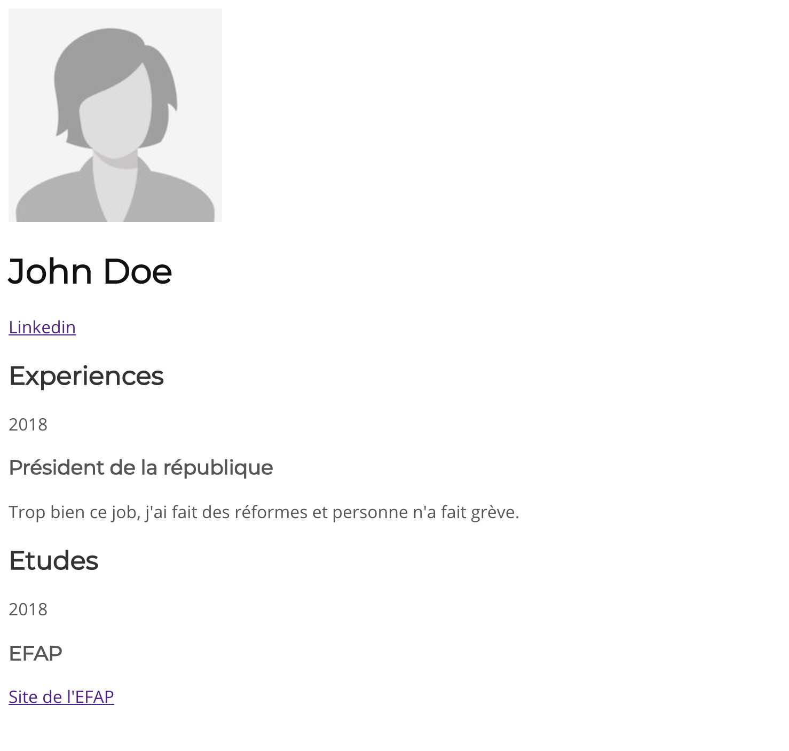

## 3.3. Structurons notre page avec des div !

En fait, les éléments balisés d'une page Web sont rassemblés dans des blocs eux-mêmes balisés : on pousse encore plus loin l'image des "poupées russes". Ainsi, la page d'accueil d'Apple est constituée de blocs dans lesquels il y a d'autres sous-blocs où on retrouve des sous-sous-blocs ...(ainsi de suite)... jusqu'à ce qu'on trouve les balises HTML traditionnelles (`h1, p, a, ul, li, img ...`) :

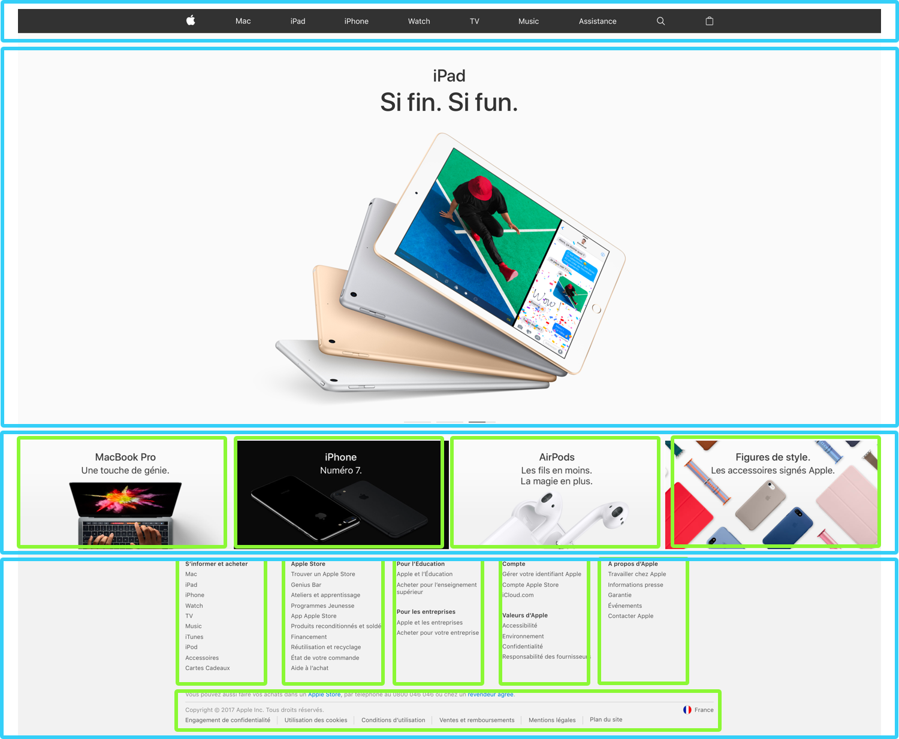

Pour baliser un bloc, on utilise les balises `<div class="">` (ouvrante) et `</div>` (fermante).

Notre fichier `index.html` doit correspondre à quelquechose près à ceci :
```html
<!-- Code HTML à avoir dans les grandes lignes à ce stade-->
<!DOCTYPE html>
<html>
  <head>
    <title>John Doe</title>
    <meta charset="utf-8">
      <link href="https://fonts.googleapis.com/css?family=Montserrat|Open+Sans:300,400,700" rel="stylesheet">
    <link rel="stylesheet" type="text/css" href="styles.css">
  </head>
  <body>
    <div class="header">
      <!-- Code HTML du haut de la page avec votre nom et photo -->
    </div>

    <div class="wrapper">

      <div class="experience">
        <!-- Code HTML de la partie des expériences -->
      </div>

      <div class="education">
        <!-- Code HTML de la partie des les études -->
      </div>

    </div>
  </body>
</html>
```

On remarque l'attribut facultatif `class="nom_de_classe_du_bloc"` de la balise ouvrante qui va servir de sélecteur dans le `.css` auquel on va attribuer des règles de styles qui s'appliqueront à toutes les div de classe `"nom_de_classe_du_bloc"` (et à ce qu'il y a à l'interieur aussi).

❗️Attention❗️ Après avoir ajouté les div, rien ne doit avoir changé sur la page de votre navigateur Web. Et rassurez-vous, c'est normal ! En effet, nous n'avons pas encore appliqué de règles de style aux classes associées : header, wrapper etc.!

NB : Pour visualiser les blocs correspondant aux div, vous pouvez rajouter temporairement des bordures rouges aux div si vous rajoutez dans la feuille de style CSS `style.css`, le code suivant (à bien supprimer pour la suite):
```css
div {
  border: 2px solid;
  border-color: red;
}
```

## 3.4. Rendons le tous plus lisible avec un peu de CSS !
Ajoutez les code ci-dessous dans le CSS pour styles le `header` et le `wrapper` 
```css
.header{
	background: linear-gradient(to right, #028e47, #00eba4);
	height: 300px;
	padding: 50px;
	text-align: center;
	color: #ffffff;
}

.wrapper {
	padding: 50px;
	max-width: 700px;
	margin-right: auto;
	margin-left: auto;
}
```

Et pour rendre le nom plus lisible dans le CV, changons la couleurs des titres `h1` pour les mettre en blanc (code couleur `#ffffff`)
Votre site doit maintenant ressember à ça : 
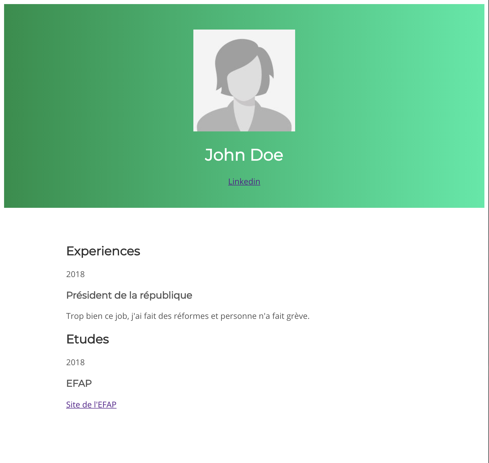
Il commence à prendre forme ! 👍

## 3.5 Continuons à structurer la page !
### 3.5.1 HTML
Nous allons continuer à structurer la page étape par étape.
On va commencer par mettre le contenu de la première expérience dans un `div` avec la classe `item`, comme ci-dessous.
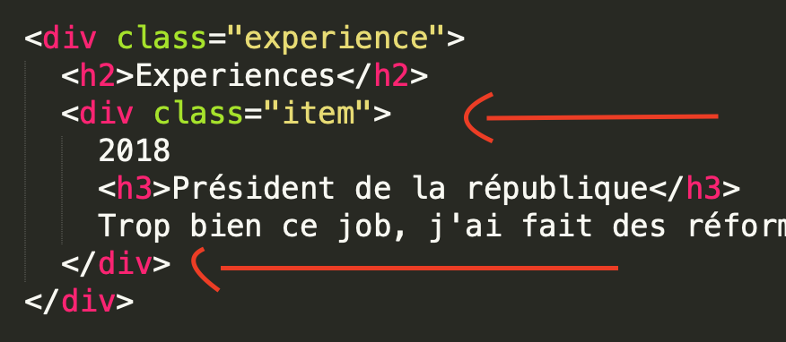
A nouveau, on ne doit pas voir de changement visuel dans la page web dans le navigateur.

On continue en mettant :
- la date dans un `<div class="date"> </div>`
- le titre et la description dans un `<div class="content"> </div>`
- et enfin le descriptipn dans un `<div> </div>`

Le code doit ressember à ça pour la partie expérience:
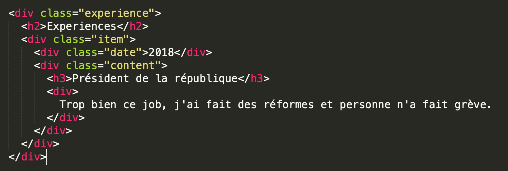

### 3.5.2 CSS
Puis on va ajouter dans le css :
```css
body, html{
    margin:0;
    padding:0;
}

.item > *{
	display: inline-block;
}

.date {
	vertical-align: top;
	padding-right: 10px;
}

h3 {
	margin-top: 0;
}
```

Si tout s'est bien passé votre CV ressemble à :
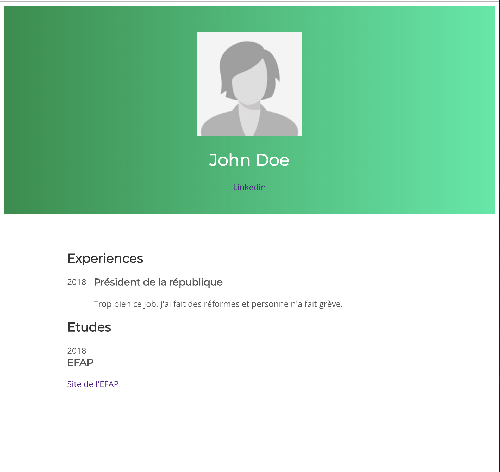

## 3.6 A vous de jouer !
### 3.6.1  Structurer la section "études"
Reproduiez les étapes du 3.5.1 mais pour la section études cette fois-ci. 
Résultat :
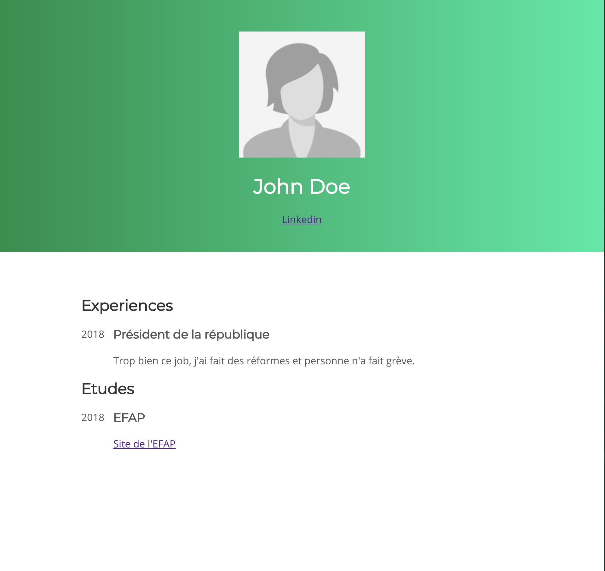

### 3.6.2 Photo
On va maintenant s'occuper de la photo.
On va ajouter dans le fichier HTML une classe `my_photo`.
La ligne doit maintenant ressember à :
```html

```

Puis dans le css, on va ajouter des propriétés à cette classe pour avoir une image ronde:
```css
.my_photo {
  border-radius: 75px;
  height: 150px;
  width: 150px;
}
```
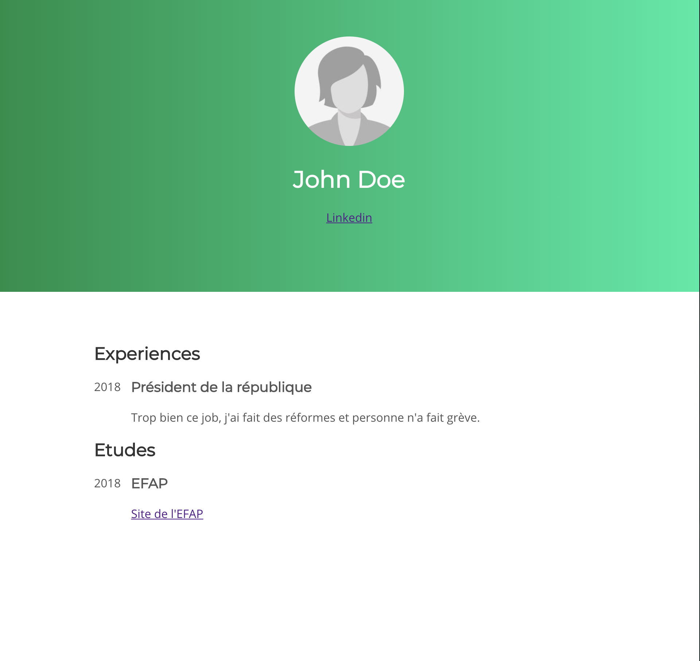

## 4 Personnalisation
### 4.1 Remplacez avec votre nom et prénom, expériences et études

Remplacer dans la page les information génériques du DM pour qu'elle soit maintenant à votre nom.
Modifiez également les études et expérience avec les vôtres (ou alors vous pouvez en inventer !)

### 4.2 Personnaliser le CSS
Il est temps de choisir vos propres couleurs, tailles de polices, marge etc.
Modifiez le CSS à pour personnaliser votre CV.

### 4.3 Ajoutez une autre expérience et étude.
### 4.4 Changer la photo
Il vous faudra mettre une photo dans le dossier `images` puis remplacer son nom dans la balise ``
Vous pouvez prendre example sur avec la phot existante.
### 4.5 Page de contact


# 5. Conclusion & Debriefing
Si vous en êtes arrivé jusque là, BRAVO ! 🤙💪👍👏
Pour résumer, ensemble nous avons fait beaucoup de choses :
- structuré le contenu d'une page Web grâce aux balises HTML
- stylisé les éléments balisés :
  - à la main dans le fichier CSS `style.css`
  - en important des polices

# Pour aller plus loin
Voici des liens utiles et très intéressants !
- Web Design in 4 minutes : http://jgthms.com/web-design-in-4-minutes/ (really nice one !)
- Learn more about HTML/CSS : http://marksheet.io/ (nice one !)
- Liste des balises HTML https://developer.mozilla.org/fr/docs/Web/HTML/Element
- Liste des propriétés CSS : http://cssreference.io/ (very good one !)
- Liste 2 des propriétés CSS : https://developer.mozilla.org/fr/docs/Web/CSS/Reference
- Tutoriel 1 HTML/CSS OpenClassrooms : https://openclassrooms.com/courses/prenez-en-main-bootstrap (very complete one but long)
- Tutoriel 2 HTML/CSS Le Wagon : http://bit.ly/2dS5cC8 (**EXCELLENT** one and really efficient but you need to pay sadly... :S )